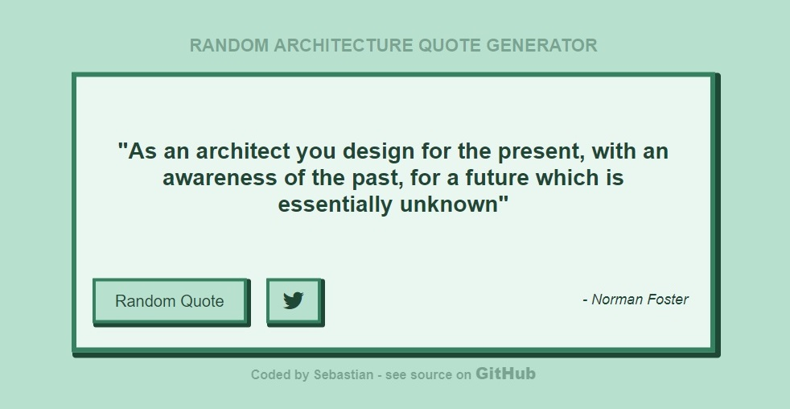

### Welcome to my Random Architecture Quote Generator

[See it in action here](https://sebam2k4.github.io/Random-Quote-Generator-JS)

### Made with:
* HTML5
* CSS3
* JavaScript

### How it works:
1. script.js contains two arrays, one stores quotes and the other stores color schemes
2. Get random number, but not same as before
3. Use random number to get new quote from arrays
4. Display new quote and update colors on 'Random Quote' button click

### Changelog: 
* 22/08/2017: Added transition to background
* 20/08/2017: Pick unique new quote and color scheme on 'Next' button click. (No same quote or color scheme can be picked in a row)
